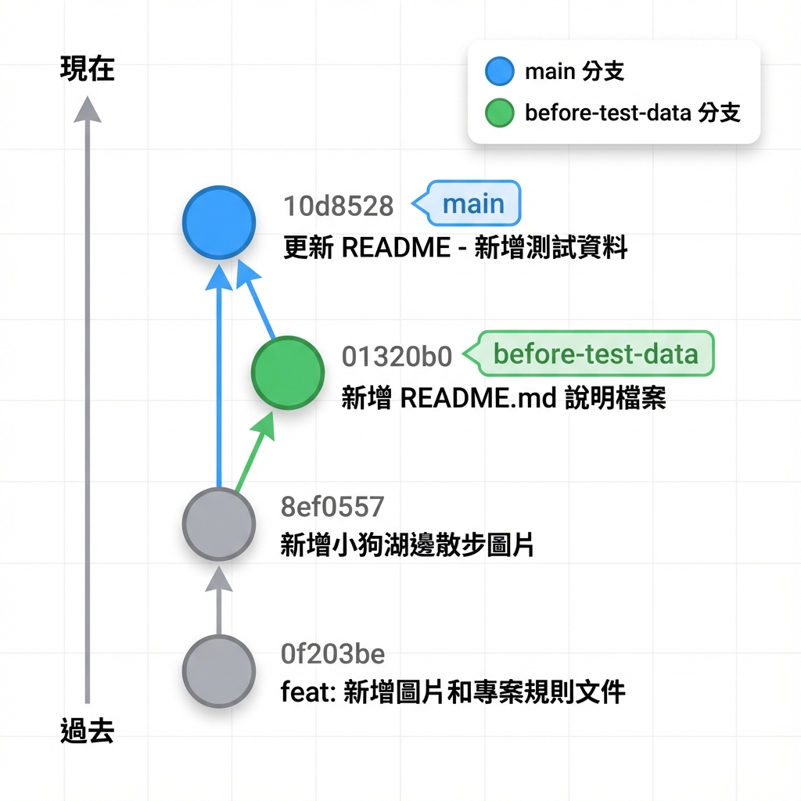
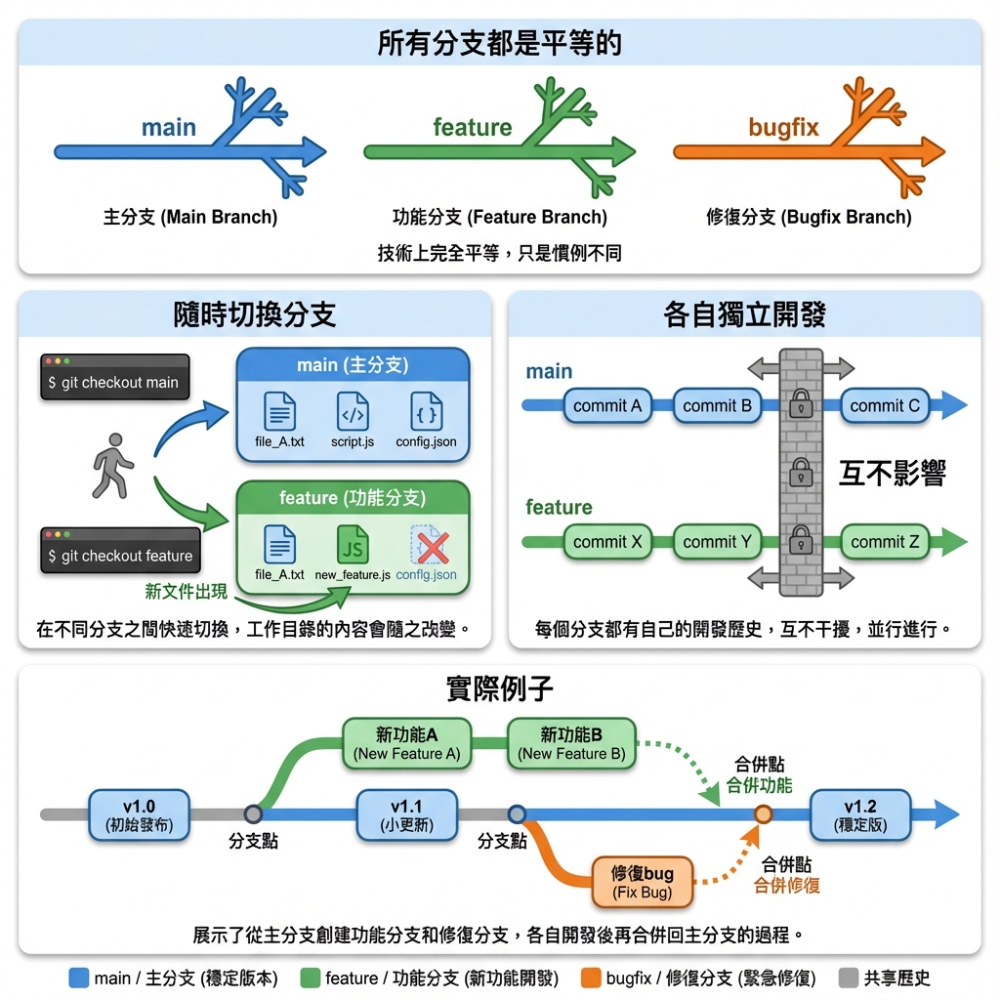
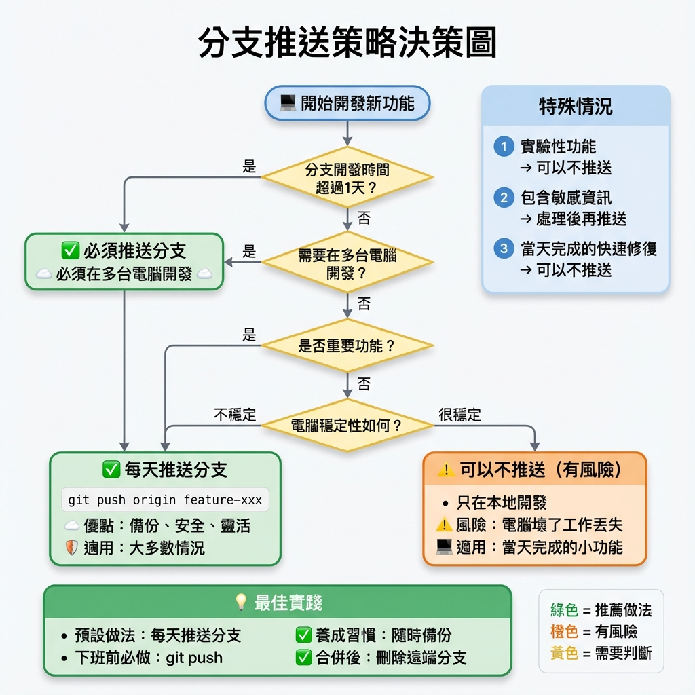
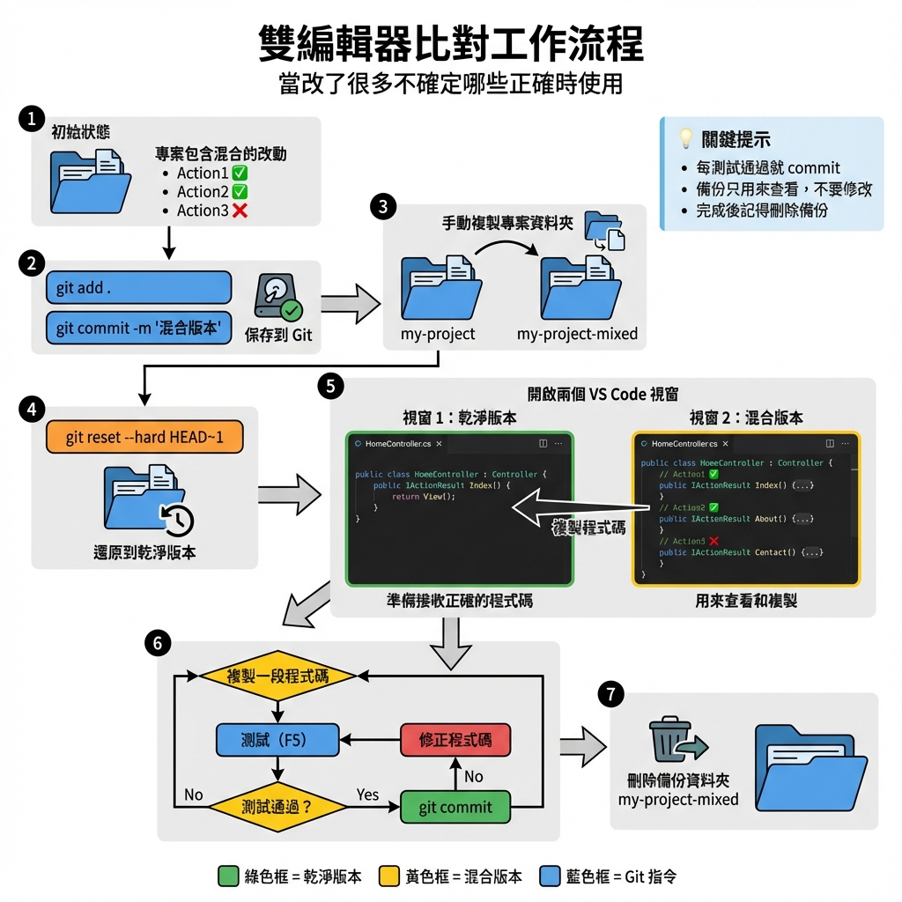

# 🖼️ Images Repository

這是一個用於儲存各種圖片資源的倉庫。

## 📁 目前的圖片

### 影片用圖片

#### 1. Optimus Prime（柯博文）

- **檔案名稱**: `optimus_prime.png`
- **用途**: 影片結尾圖片

#### 2. Truck Opening（大卡車開場）

- **檔案名稱**: `truck_opening.png`
- **用途**: 影片開場圖片

#### 3. Puppy Lakeside Walk（小狗湖邊散步）

- **檔案名稱**: `puppy_lakeside_walk.png`
- **描述**: 一隻可愛的小狗在黃昏時分的湖邊散步

### Git 教學圖片

#### 4. Git Branch Diagram（Git 分支圖）

- **檔案名稱**: `git_branch_diagram.png`
- **描述**: Git 分支結構說明圖

#### 5. Branch Relationship Diagram（分支關係圖）

- **檔案名稱**: `branch_relationship_diagram.png`
- **描述**: 分支之間的關係與操作說明

#### 6. Daily Git Workflow（每日工作流程圖）

- **檔案名稱**: `daily_git_workflow.png`
- **描述**: 工程師的每日 Git 工作流程

#### 7. Branch Push Strategy（分支推送策略圖）

- **檔案名稱**: `branch_push_strategy.png`
- **描述**: 分支推送策略決策流程圖

#### 8. Dual Editor Workflow（雙編輯器工作流程圖）

- **檔案名稱**: `dual_editor_workflow.png`
- **描述**: 雙編輯器比對工作流程，用於處理混合改動

## 📝 使用說明

所有圖片都可以直接透過 GitHub 的 raw URL 存取：

```
https://raw.githubusercontent.com/zhangs1124/images/main/<檔案名稱>
```

例如：
```
https://raw.githubusercontent.com/zhangs1124/images/main/optimus_prime.png
```

## 🔧 技術資訊

- **倉庫類型**: 公開倉庫
- **主要分支**: `main`
- **建立日期**: 2025-12-11
- **圖片總數**: 8 張

## 📜 授權

此倉庫中的圖片僅供個人使用。

---

**最後更新**: 2025-12-11